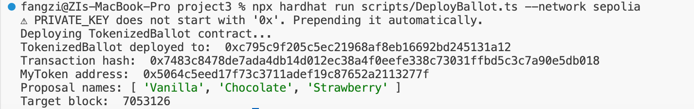
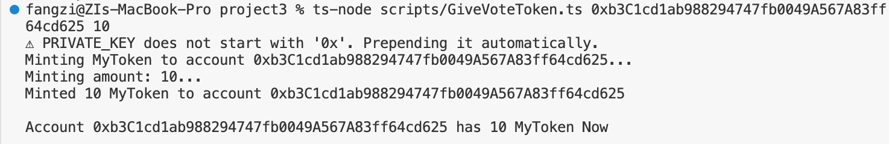
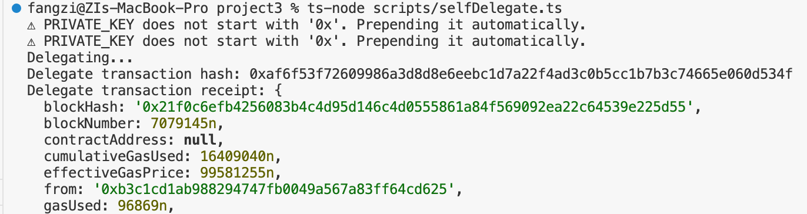
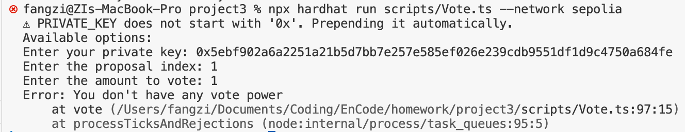
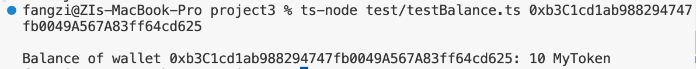

# project3
Develop and run scripts for “TokenizedBallot.sol” within your group to:
- give voting tokens
- delegating voting power
- casting votes
- checking vote power
- querying results    
- Write a report with each function execution and the transaction hash, if successful, or the revert reason, if failed

1. Depoly token
- Transaction hash: 0xbb61764e9ced8d723ec819d5f5939a0786ea4eb6c46d753a6a554eb0645d5917
- MyToken address: 0x5064c5eed17f73c3711adef19c87652a2113277f

2. Deploy ballot
- Transaction hash: 0x7483c8478de7ada4db14d012ec38a4f0eefe338c73031ffbd5c3c7a90e5db018
- Ballot address: 0xc795c9f205c5ec21968af8eb16692bd245131a12
- Proposals:  [ 'Vanilla', 'Chocolate', 'Strawberry' ]
- Target block: 7053126

3. Give voting tokens

4. Self Delegate
- Delegate transaction hash: 0xaf6f53f72609986a3d8d8e6eebc1d7a22f4ad3c0b5cc1b7b3c74665e060d534f
- Delegate transaction receipt:
- blockHash: '0x21f0c6efb4256083b4c4d95d146c4d0555861a84f569092ea22c64539e225d55',
- blockNumber: 7079145n,
- contractAddress: null,
- cumulativeGasUsed: 16409040n,
- effectiveGasPrice: 99581255n,
- from: '0xb3c1cd1ab988294747fb0049a567a83ff64cd625',
- gasUsed: 96869n,

5. Vote
❌ Error

Test  
a. testBalance.ts

